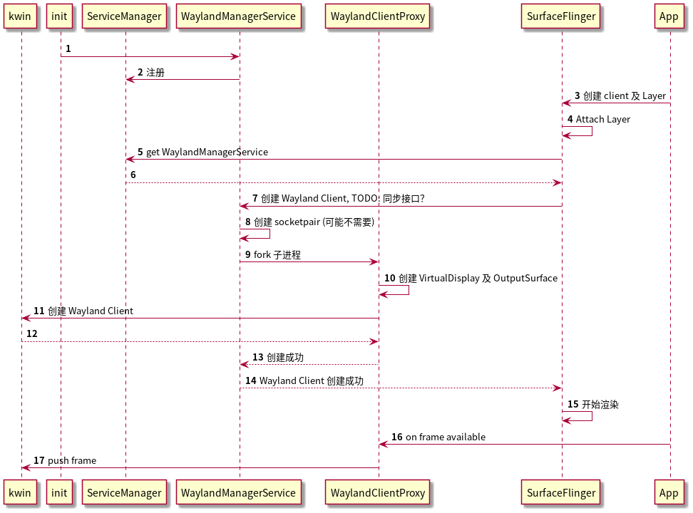
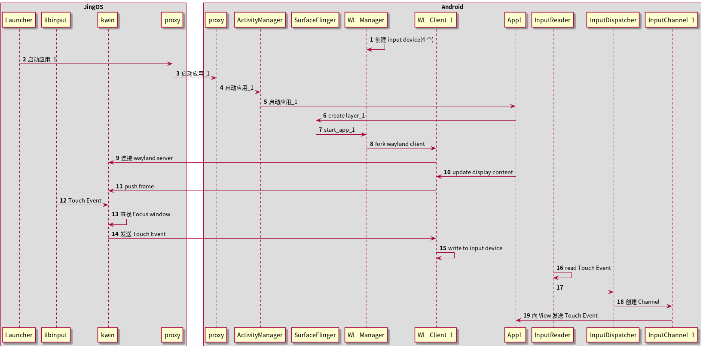
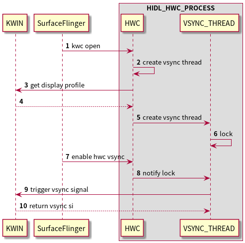

WLManagerService
====
Android 端负责对接 Wayland Service( KWin ) 的服务

程序是如何工作的
----
如果 AMS 已经成功启动了应用但在 WLManagerService 流程中出现错误，不管是哪个流程出现错误均会导致 JingOS 侧的窗口创建超时，如果发生此类错误，
则由 JingOS 的应用启动器与 KWin 配合杀掉应用。

如何处理 Input Event
---

VSYNC 控制
---

问题
---
* 为什么需要一个 Service
  
  原则上对 SurfaceFlinger 不做过多修改，如果没有 Service，就需要在 SF 中 fork 子进程，导致修改极多，所以设计一个 Service 来托管 fork 工作

  Service 也可通过如 socketpair 机制来对子进程进行管理

* 为什么每个应用都需要对应 N 个 wayland client 进程

  Anbox 的单窗口方案将 SurfaceFlinger 做为一个 wayland client， 当 kwin 执行 kill 操作时，
  SurfaceFlinger 就会被杀掉，导致系统重启，技术方案不合理。

TODO
----
- [x] ATRACE 集成
- [x] Binder Service 编译/基本结构
- [x] fork 子进程
- [x] 应用渲染至指定 VirtualDisplay
- [ ] VirtualDisplay & Layer 对应关系管理
- [x] 集成 wayland client
- [ ] 窗口状态调试
- [x] 测试客户端
- [x] 文档补充
